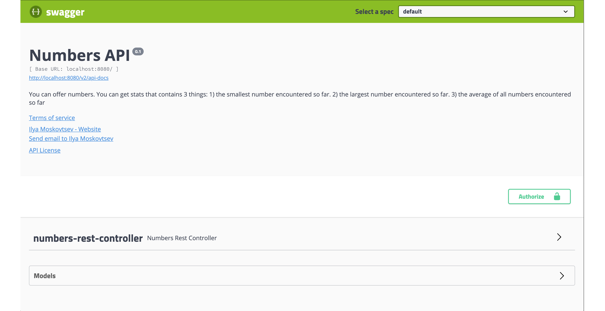
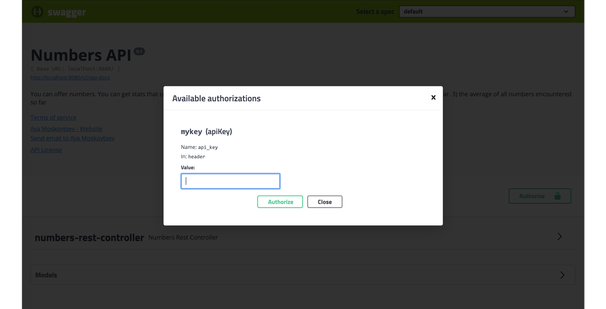
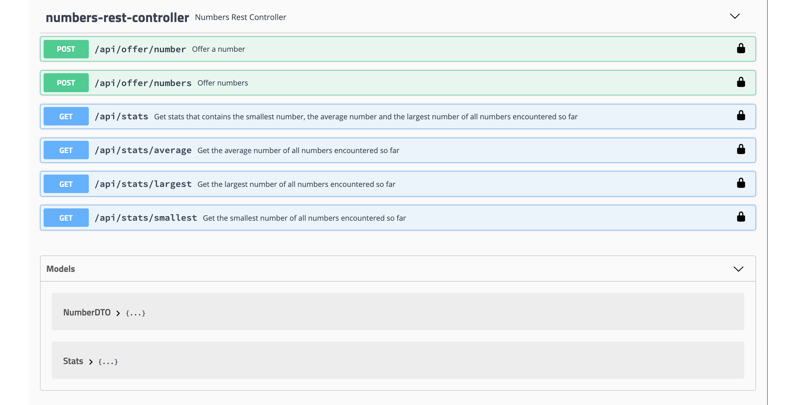

# Numbers API

This is an implementation of the following task:<br>
```text
Create a thing that can be offered numbers.

At any given time it can tell 3 things:
1) the smallest number it has encountered so far
2) the largest number it has encountered so far
3) the average of all numbers it has encountered so far

Prove that it is working correctly.
Make it so that a novice programmer cannot use it the wrong way,
nor that an evil programmer can break it.
```

## Interactive API documentation:
1) start this application `org.nameapi.NumbersApplication`
2) open http://localhost:8080/swagger-ui.html
<br>


3) authorize with `application.properties:numbers.http.auth-token`
<br>


4) you can now test available numbers api
<br>


